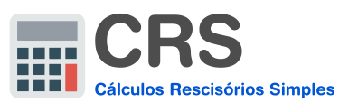

O CRS é uma aplicação Java para Desktops que realiza de forma simplificada, alguns dos principais itens presentes em uma rescisão trabalhista.

# Recursos
* Realiza os sequintes cálculos:
  * Último salário (proporcional ao total de dias trabalhados).
  * 13º salário.
  * Férias proporcionais.
  * 1/3 das férias.
  * Férias vencidas.
  * 1/3 das férias vencidas
  * Aviso prévio (Valor a receber | Valor a ser descontado | Qtd de dias).
  * FGTS.
  * Multa de 40% sobre o valor do FGTS.

* Exporte o resultado dos cálculos em uma planilha (XLS) e consulte sempre que precisar.
* Aplicativo multiplataforma: Windows / Mac OS X / Linux.
* Portátil: Dispensa instalação, clique e execute.
* Livre de Spyware, Adware e outros tipos de malwares.

## Requisitos
Ter o [Java 8](https://www.java.com/en/download/) baixado e instalado em sua máquina.

## Última versão lançada

| Obter aplicação :                                |  
|:-------------------------------------------------|
| [0.60.2-build20170416-1600.jar](https://github.com/tglima/CRS/releases/download/v0.60.2/0.60.2-build20170416-1600.jar)                                 |

| Tipo de arquivo    | Executável jar                    |
|:-------------------|:----------------------------------|
| Versão             | 0.60.2                            |
| Build Date         | 16 de Abril de 2017               |  
| Tamanho            | < 15MB                            |
| MD5SUM             | becbdb98e4d8cc3e67e70bdb743bd82b  |

Últimas modificações do projeto: [CHANGELOG](CHANGELOG.md)

## Licença

>**This application is licensed under the [GPLv3](http://www.gnu.org/licenses/gpl-3.0.html).** 

This application is distributed in the hope that it will be useful, but WITHOUT ANY WARRANTY; without even the implied warranty of MERCHANTABILITY or FITNESS FOR A PARTICULAR PURPOSE. See the GNU General Public License for more details.

Este programa é software livre: você pode redistribuí-lo e / ou modificá-lo sob os termos da Licença Pública Geral GNU publicada pela Free Software Foundation ([GPLv3](http://www.gnu.org/licenses/gpl-3.0.html)).

-----

This software uses icons from the [Ultra-Flat-Icons icon set by Steftrikia](steftrikia@gmail.com).

The Ultra-Flat-Icons icon set is licensed under a Creative Commons [Attribution-NonCommercial-ShareAlike 4.0 International License](https://creativecommons.org/licenses/by-nc-sa/4.0).
